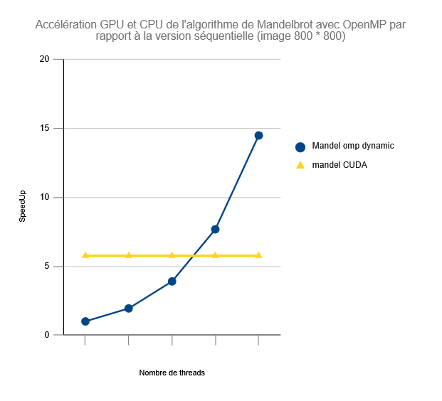
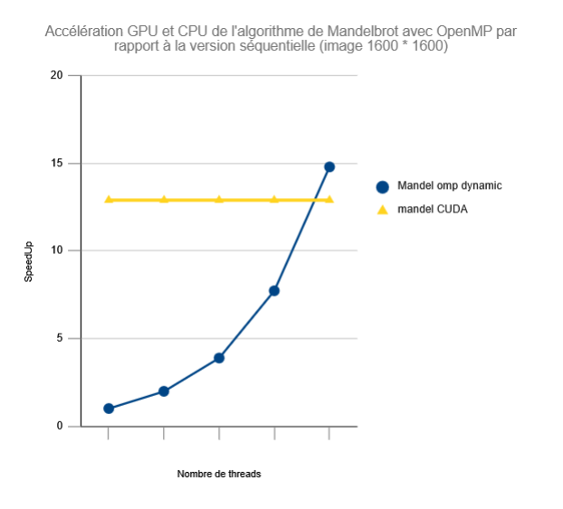

## Analyse des performances

### Équipe

Ce travail a été effectué par :
* Alex Deprez
* Antoine POURTHIÉ

### Environnement et Méthodologie

Nous n'avons pas été en mesure d'effectuer l'execution des programmes sur l'infrastructure Grid5000, elles ont donc été faites sur la machine locale d'Antoine, possédant le processeur graphique `AMD Ryzen 7 7800X3D` avec 8 coeurs physiques 16 coeurs logiques, ainsi qu'une carte graphique `NVIDIA GeForce RTX 3060` avec 3584 CUDA coeurs et une bande passante de 360 GB/s et une fréquence boost de 1777 MHz. Ce qui nous a permis d'effectuer des mesures jusqu'à 16 threads pour la partie OpenMP. La compilation a été réalisée avec `gcc` (options `-fopenmp` et `-lm`) pour la version OpenMP, et `nvcc` pour la version CUDA, avec les flags d'optimisation tel que `-Wall -O3`.

Pour garantir la fiabilité des données, tous les calculs de temps ont été effectués 3 fois et c'est la moyenne qui est analysée afin d'éviter les anomalies. L'ensemble des valeurs brutes est disponible dans le fichier [donnees.ods](./donnees.ods).

Afin d'étudier l'impact sur les performances, les mesures ont été réalisées sur deux tailles d'images : 800x800 et 1600x1600 pixels. Nous comparons ici trois implémentations :
- **Sequentiel** : version de référence du calcul
- **OpenMP `Dynamic, 1`** : la meilleure stratégie de scheduling identifiée dans le premier rendu
- **CUDA** : version GPU avec une grille de blocs de 16x16 threads

---

### Résultats

---

### Analyse

#### 1. Version séquentielle : la référence

La version séquentielle sert de base de comparaison pour toutes les mesures de speedup (speedup = 1.00).
Elle effectue le calcul pixel par pixel, ligne par ligne, sur un seul coeur CPU.
Le passage de 800×800 à 1600×1600 (4 fois plus de pixels) fait passer le temps de `1.2769 s` à `4.7046 s`, soit un facteur `~3.7`.

#### 2. Version OpenMP : une montée en charge linéaire

La version OpenMP avec le scheduler `Dynamic, 1` offre les meilleures performances sur CPU.
Dès qu'un thread termine une ligne de l'image, il en prend immédiatement une nouvelle.
Cette granularité fine permet de lisser la charge de travail irrégulière.
On observe que le speedup est quasi-identique entre 800x800 et 1600x1600 pour un même nombre de threads (`~14.48` vs `~14.79` à 16 threads).

#### 3. Version CUDA : un speedup non linéaire

La version CUDA affiche un speedup de **~5.76** par rapport à la version séquentielle, sur une image 800×800, ce qui reste inférieur à la version OpenMP à 8 threads. Ceci s'explique par :

- **Les transferts mémoire CPU à GPU sont inclus dans le temps total.** Le chronométrage démarre avant le `cudaMalloc` et s'arrête après le `cudaMemcpy`. Sur une image 800x800, ces transferts représentent une part non négligeable du temps total.
- **La taille du problème est trop petite pour saturer le GPU.** Avec 800x800 pixels, le ratio calcul/transfert est défavorable : le GPU passe une partie significative du temps à initialiser et à transférer des données plutôt qu'à calculer.
- **Le CPU bénéficie du cache.** Les threads OpenMP partagent certains caches ce qui accélère les accès mémoire. Le GPU ne dispose pas de cet avantage.

En revanche, à **1600×1600**, le speedup bondit à **~12.88**, soit plus du double. Le ratio calcul/transfert devient alors favorable au GPU.

---

### Conclusion

Pour un calcul de taille modeste comme une image 800x800, OpenMP sur CPU reste plus efficace grâce à l'absence de transferts mémoire et à la bonne exploitation du cache.
Le GPU en revanche se rapproche rapidement d'OpenMP dès que la taille de l'image augmente, et pourrait prendre l'avantage pour des tailles encore plus grandes.